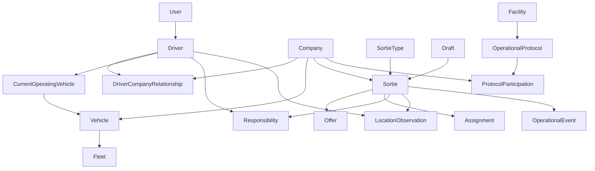

# Domain Model and Invariants

## Status

**Derived from:** Architectural Specification v0.1 (`docs/01-architecture..md`).

**Purpose:** Restate the domain decisions in that specification as one model: the concepts the platform recognizes, how they relate, and the rules that must remain true.

This document does not add mechanisms the architectural specification left open. It does not specify persistence, APIs, or user-interface behavior. Where this document and the architectural specification disagree, the architectural specification remains the source until it is revised.

Later documents own lifecycle transitions, scheduling calculations, driver workflows, facility-protocol internals, sortie ingestion, realtime transport, and technical architecture. Those topics appear here only when a distinction has to be preserved so it is not collapsed into the wrong concept.

---

# 1. How to read the model

A **sortie** is the central operational unit. Everything else exists to identify who may perform work, under which company's authority, with which vehicle, under which external constraints, and with which recorded evidence.

Three distinctions run through the whole model:

1. **Platform invariants** stay true for every company. **Configuration** varies by company or facility, and must not be promoted into universal meaning.
2. **Current state** answers what is happening now. **History** answers how the current state was reached. They are separate.
3. **Evidence** is not the same thing as **authoritative state**. An observation, an inference, and a human assertion can all exist without any one of them being the committed operational fact.

The platform coordinates professional ground-driving operations. Taxi work is one use of the platform. Taxi is not a fundamental domain concept. Taxi-specific behavior belongs in company configuration or in a particular sortie type.

---

# 2. Epistemic categories

The platform keeps these categories distinct. A later record may carry more than one, but it must still say which category each part belongs to.

## 2.1 Observed fact

Something the platform received from the world, with its source and time.

A GPS fix is an observed fact. A driver-submitted traffic report is an observed fact. Presence inside a geofence, when established from location observations, is evidence. It is not, by itself, a statement of human intent.

## 2.2 System inference

A conclusion the platform computed from observations and other known state.

Arrival at a pickup, departure from a pickup, and an inferred activity time are inferences when they are reconstructed from GPS and schedule context. An inference records what the platform concluded and what it does not claim to know. The platform does not treat an inferred passenger-entry time as an exact time it did not observe.

Where a sequence is observable and a cause is not, the history preserves the sequence. Causal attribution stays an inference until it is established.

## 2.3 Human assertion

An explicit act by a person: accepting responsibility, rejecting an assignment, commencing a sortie, completing a sortie, revising a wait ceiling, confirming a vehicle, overriding a schedule warning, or submitting a cancellation request.

An assertion is evidence of what the person did. It becomes authoritative operational state only after the server accepts the corresponding command.

## 2.4 Authoritative state

The server's committed operational facts: who is responsible, whether a sortie is complete, whether a driver is available, what a facility protocol says a participant's state is, and which vehicle the driver is currently operating.

Clients display state, send commands, and report observations. A client does not establish authoritative assignment, responsibility, completion, or facility state on its own.

## 2.5 Current state and history

Current state is the latest authoritative picture.

History is an immutable chronological record of significant operational events. It includes creation, assignment, offer, acceptance, rejection, transfer, cancellation request, cancellation response, commencement, completion, schedule changes, overrides, and facility-state transitions, among other consequential actions.

History is retained according to the effective retention policy. The model does not assume that history is stored forever.

## 2.6 Provenance

Provenance records where a fact came from: which person, channel, or system produced it, and whether it arrived as an observation, an inference, or an assertion.

The channel that created a sortie is provenance. A sortie created by a driver, a dispatcher, a telephone workflow, a customer booking, or an external integration is still a sortie.

---

# 3. Entities

## 3.1 User

A **user** is a human identity.

A user may hold one or more operational relationships with companies. A user may hold platform-supported roles. The role vocabulary is controlled by the platform and includes driver, dispatcher, fleet manager, company manager, customer-service personnel, platform administrator, and other roles the platform adds.

A company configures which capabilities its roles receive. A company does not invent platform roles.

**What it is not.** A user record is not by itself authorization to every company or every sortie. A role name is not a company-defined custom type.

**Relationships.** A user is the identity behind a driver. A user participates in companies through operational relationships. Authorization uses that identity together with company relationship, role capability, operational relationship, context, and facility participation where it applies.

## 3.2 Company

A **company** is an organization operating on the platform. It is the primary organizational and business boundary.

A company operates vehicles, associates drivers, configures its own operational behavior, creates and receives sorties, participates in facility protocols, and has its own retention and configuration policies.

Companies are tenants. Company data, authorization, visibility, and configuration stay inside that boundary unless a deliberate cross-company relationship says otherwise.

**What it is not.** A company is not a facility. A company's reading of protocol state is not the protocol itself. A company is not an employment boundary for drivers.

**Relationships.** A company has many drivers through driver–company relationships, many vehicles, zero or more fleets, many sorties for which it is the company of record, and participation in zero or more operational protocols.

## 3.3 Driver

A **driver** is a user who can perform driving operations.

The driver concept stays explicit. It is not a boolean on the user, and it is not a second human identity.

A driver may hold operational relationships with multiple companies at the same time. Those relationships are many-to-many. The platform does not assume employment, exclusivity, a permanent vehicle, or a permanent fleet. A company configuration may add those conditions for that company.

**What it is not.** A driver is not a vehicle. A driver's device location is not the location of every vehicle associated with that driver. Being a driver for a company does not grant access to that company's whole operation, or to another company's confidential work.

**Relationships.** A driver has company relationships, a duty state, an availability flag, at most one current operating vehicle, location observations from the driver's device, and zero or one responsibility for each sortie.

### Driver state that is not a separate entity

**Availability** is a boolean. Available means the driver is willing to receive and accept dispatch work.

**Duty** is a separate on-duty or off-duty state. Off duty stops GPS transmission. On duty starts GPS transmission unless the current vehicle is ambiguous. Which party controls duty — the driver, the schedule, or some other company-assigned rule — is configuration.

Availability and duty are both driver state. Neither one is inferred from the other, and neither one is defined by a facility queue position.

## 3.4 Driver–company relationship

A **driver–company relationship** is the operational authorization between one driver and one company.

It means the driver may perform work for that company under that company's configuration and authorization. It does not mean employment.

**What it is not.** It is not a sortie assignment, a vehicle assignment, or a statement that the driver works only for that company.

**Relationships.** Many drivers per company. Many companies per driver.

## 3.5 Vehicle

A **vehicle** is a physical vehicle.

A vehicle has capabilities, restrictions, a company relationship, a possible fleet relationship, and an assignment history. Vehicle assignment is controlled by the company. The driver does not assign a vehicle to themselves outside that control.

A driver may operate many vehicles over time. A vehicle may be operated by many drivers.

**What it is not.** A vehicle is not a fleet. Vehicle purpose or type is not fleet membership. A vehicle associated with a driver is not automatically the vehicle the driver is operating now.

**Relationships.** A vehicle belongs to a company's operation. It may belong to a fleet. It may be the current operating vehicle of a driver. Sorties are performed with a vehicle, and eligibility checks consider vehicle capabilities.

## 3.6 Current operating vehicle

The **current operating vehicle** is the vehicle the platform currently treats a driver as operating.

There is at most one. It may be unknown. When it is unknown, vehicle identity is ambiguous, and the platform may require the driver to confirm it. When company configuration already makes the vehicle unambiguous, that confirmation is unnecessary.

GPS is an observation from the driver's device. The platform may treat that observation as the vehicle's location only while this current vehicle is known. Those observations do not attach to every vehicle the driver has used or is allowed to use.

**What it is not.** It is not the history of vehicle assignments, and it is not a permanent pairing.

## 3.7 Fleet

A **fleet** is a logical grouping of vehicles or other operational resources.

A company may use one fleet that contains several vehicle types, several fleets, or another supported organization of fleets. Fleet membership and vehicle purpose or type remain different facts.

**What it is not.** A fleet is not a vehicle type, a company, or a facility.

## 3.8 Facility

A **facility** is an external physical organization or location that imposes operational procedures on participating drivers.

Airports, hotels, and passenger terminals are examples. They are examples of facilities, not separate platform concepts.

A facility has one or more operational protocols. The platform team configures those protocols. Facilities do not receive a self-service configuration console in the initial model.

**What it is not.** A facility is not a company. A facility protocol is not "airport taxi" as a core object.

**Relationships.** A facility owns the real-world process. The platform holds the digital protocol. Companies participate in protocols; they do not become the facility by participating.

## 3.9 Operational protocol

An **operational protocol** is the platform's representation of an externally governed operational process.

A protocol may define operational areas, geofences, queue positions, capacity, participant states, signals, driver actions, system observations, and the transitions and enforcement that go with them. The internal authoring model for those definitions is an open decision. The concept is not.

One protocol may apply to many companies. One company may participate in many protocols.

The protocol defines what is happening at the facility. The company defines what that protocol state means for its own operation, including whether a queue position or curb occupancy makes a driver unavailable for dispatch. Those company consequences are configuration. They are not part of the universal meaning of a queue.

**What it is not.** A protocol is not a company rule set. Queue position is not a universal definition of driver availability. A suspected protocol violation is not automatically an intentional abandonment; GPS supplies evidence. The platform does not escalate protocol violations to external facility or company contacts.

**Relationships.** Facility to protocols: one facility, one or more protocols. Protocol participation links a company to a protocol. Participant state in a protocol is protocol state, distinct from driver availability and duty.

## 3.10 Sortie

A **sortie** is a discrete operational task performed by a driver using a vehicle.

It is an independent domain object. It has its own identity, type, required data, lifecycle, assignment, responsibility, routing, schedule, operational history, location history, communication history, and completion state.

Passenger transportation, flight-crew transportation, food delivery, equipment pickup or dropoff, and supply transportation are examples of work a sortie can represent. They are not separate core types beyond the platform-defined sortie type.

A sortie has one **company of record**: the company the sortie belongs to. That association remains when operational responsibility moves to a driver at another company. Cross-company responsibility does not move ownership of the sortie and does not grant the receiving driver the originating company's broader operational data. The receiving driver receives the information required to perform that sortie.

A sortie may be unassigned. A sortie may contain an ordered series of stops. A sortie's routing is a result obtained through a replaceable routing capability. The domain model does not depend on a particular routing provider's representation.

On the driver calendar, a sortie needs one chosen address, marked as a pickup or a destination. An arrival time is optional. When the driver sets one, that arrival is the time to reach the pickup, or the destination when the sortie has no pickup. The scheduled start and the scheduled end are computed results, cached on the sortie. They are not a second kind of appointment. The start is that arrival minus the traffic-aware drive to the first place. When another sortie has an earlier arrival, that drive starts at the earlier sortie's last place. Otherwise it starts at the driver's latest location observation. The end is the arrival when nothing follows that place, otherwise the arrival plus the traffic-aware drive from the pickup through each waypoint to the destination. When the driver does not set an arrival, the sortie departs immediately from the latest location observation. The arrival is then now plus the drive to the first place, and the start is now. The calendar draws the cached window. The summary of a sortie shows the address of the place that drive started from, which is the same place used to compute the start.

**What it is not.** A sortie is not a calendar event, a draft, a booking object, a telephone call, or a taxi job. Creation channel does not create a different downstream object. Customer and passenger details are data carried by the sortie according to its type. They are not a universal passenger entity.

**Relationships.** One company of record. One platform-defined sortie type. Zero responsible drivers before acceptance, and exactly one after acceptance. Zero or more offers. Location observations and communications may be associated with it. Its history is a sequence of operational events.

## 3.11 Sortie type

A **sortie type** is a platform-defined kind of sortie.

The platform defines the available types and, for each type, the schema, required fields, supported capabilities, required qualifications, and other structural requirements. A company is enabled for types through platform-administered configuration. The company does not add arbitrary custom fields. When a company is enabled for a type, the whole defined schema is available under platform rules.

**What it is not.** A sortie type is not a company-invented form, and it is not a separate lifecycle.

## 3.12 Draft

A **draft** is pre-authoritative sortie data produced by a creation channel that needs review before a sortie exists.

A draft may hold customer identity, a telephone number, pickup, destination, date, time, passenger information, service requirements, an estimated cost, and other fields of the relevant sortie type. Those fields are whatever that channel and sortie type require. They are not a second universal schema.

Drafts may be shown and updated as they are built. Data produced by an automated or AI extraction remains draft data until a person validates it and the server creates the sortie. Validation of a draft produces a sortie. The draft is not itself the authoritative sortie.

**What it is not.** A draft is not required for every sortie. Channels that create a sortie directly do not have to pass through one. A draft is not a separate kind of work that dispatch must treat differently after it becomes a sortie.

## 3.13 Offer

An **offer** is a proposal that one or more drivers may accept.

An offer may be addressed to one driver, to several drivers, to all eligible available drivers, or to another supported candidate group. When several drivers can accept the same offer, the first valid acceptance claims the sortie. Later acceptance attempts fail without changing responsibility.

A driver who already holds responsibility may offer the sortie to another driver. That is a transfer offer. The offering driver remains responsible until the other driver accepts. A committed driver does not drop responsibility by abandoning the sortie. Transfer, followed by acceptance, is how responsibility moves. The full transfer history is kept.

**What it is not.** An offer is not responsibility. Receiving an offer does not make the driver responsible. An offer is not an assignment, though both wait on acceptance before responsibility exists.

## 3.14 Assignment

An **assignment** is a company act that directs a sortie to a driver as future work.

At assignment time the platform checks driver eligibility, vehicle eligibility, required capabilities, the existing schedule, travel feasibility, and other known constraints. Those checks apply even when execution is far off. As execution approaches, the platform recalculates when relevant variables change. How that recalculation works belongs to the scheduling document.

A company may treat an assignment as a strong commitment. The driver may still reject it. The rejection is recorded, and the company-defined workflow that follows the rejection runs. Commitment strength never becomes a physical prohibition on the driver's action.

**What it is not.** An assignment is not acceptance. A strong commitment is not an immutable ban on rejection or on a later human override of a schedule warning.

## 3.15 Responsibility

**Responsibility** is the fact that exactly one driver is accountable for a sortie.

Acceptance is the only gate. Responsibility begins when the server records a valid acceptance. It moves only through an explicit valid transition, which for a handoff is acceptance of a transfer by the next driver. An accepted or active sortie has one responsible driver.

**What it is not.** Responsibility is not an attempted assignment, an open offer, or presence on a schedule. It is not shared among drivers.

## 3.16 Driver calendar

The **driver calendar** is the driver's set of operational commitments over time.

It may contain sorties, dispatch shifts, duty shifts, vehicle assignments, and other operational commitments. It is an operational system. Feasibility considers time, geography, routing, traffic, current location, current activity, future activity, vehicle assignment, driver capabilities, sortie requirements, facility protocols, and waiting. Those calculations belong to the scheduling document.

A sortie on this calendar is drawn from its cached start to its cached end. The driver may enter an arrival, or leave it unset so the platform computes one from an immediate departure. Tapping the sortie shows that sortie's data, including the arrival and the cached window.

A permanent relationship does not have to be repeated as a calendar event. A driver who always uses the same vehicle does not need a vehicle-assignment event for every day merely to restate that fact.

**What it is not.** The calendar is not a list of static appointments. A sortie on the calendar is still a sortie, not a generic appointment record. Another company's commitment may appear to a viewing company as occupied time, without that company's confidential detail.

## 3.17 Dispatch shift

A **dispatch shift** is a calendar commitment that designates an official dispatcher.

Dispatch is an operational function. It is not required to be a separate department. Any authorized driver of the company may perform dispatch functions the company allows: creating sorties, offering them, seeking candidates, and assigning work through the acceptance workflow.

The identity of the current dispatcher can be made known to the company's drivers. The model does not require that a company have exactly one dispatcher for all time. A dispatch shift is how an official dispatcher is designated.

**What it is not.** A dispatcher is not a separate human identity from the user who holds the role. Candidate ordering is not "nearest GPS point." Selection considers location, activity, route, traffic, existing work, schedule feasibility, availability, duty, qualifications, vehicle capabilities, and facility constraints. The selection procedure itself is outside this document.

## 3.18 Location observation

A **location observation** is a timestamped GPS fix from a driver's device.

Observations are the stored form of location. A continuous track is not a domain object. A track can be reconstructed from observations. Observations taken during a sortie may be associated with that sortie so the movement can be reconstructed later.

Each stored observation is one fix: the time reported by the device, a coordinate, and accuracy when the device provides it. The client does not record every GPS tick. It reports a fix after a meaningful move, or after a few minutes while the signed-in app is in the foreground. The latest observation is the driver's current position for an immediate departure, and for the approach leg of an authored arrival that has no earlier sortie on the calendar. A later observation recomputes that cached window when it is at least ten miles from the position used for the previous successful computation, and only while the cached end is still in the future. An authored arrival that follows another sortie uses the previous sortie's last place instead, and a GPS move does not recompute it. A computed arrival is computed again from the new position. Off duty still stops transmission. A slice that has no duty reports while the signed-in app is in the foreground. Observations are not broadcast as precise location.

Retention of observations follows the effective retention policy.

**What it is not.** An observation is not vehicle identity, not responsibility, not completion, not passenger entry, not cancellation, and not intentional abandonment of a queue. Precise location is not generally visible to every driver. Disclosure is purpose-bound. Who may see a given fix is specified with location and privacy, not by a general company permission matrix.

## 3.19 Traffic report

A **traffic report** is a lightweight observation created by a driver.

The platform records the driver, location, time, direction when it can be determined, and geographic context. The driver selects a report kind: heavy traffic, stopped traffic, accident, road closure, or hazard, and may add a short note.

A traffic report is geographically persistent, attributable, and timestamped. It can appear on other drivers' maps. It stays distinct from traffic data that comes from a routing provider. Multiple signals may later be combined. A driver report still does not become authoritative routing-provider data by being combined.

**What it is not.** A traffic report is not a sortie and not a facility protocol signal.

## 3.20 Communication

**Communication** associated with a sortie is an exchange about that sortie relationship.

It may remain part of operational history after the sortie is complete, subject to retention. A cross-company exchange about a transferred sortie does not open either company's other operational data.

**What it is not.** Sortie communication is not a general company message store.

## 3.21 Operational event

An **operational event** is one immutable entry in history.

Events record consequential actions and transitions, including the examples in section 2.5. Each event preserves the epistemic category of what it records, so an inference is not later read as an observed fact.

Current state may be updated because of an event. The event remains the record of the change. The event-store mechanism is an open decision. The separation is not.

## 3.22 Retention policy

A **retention policy** states how long a category of operational data is kept.

Platform-level and company-level policies may both exist. The **effective retention policy** is the policy that actually governs a category, including GPS observations, sortie history, operational events, and communication history. This document does not define the precedence between platform and company policies.

**What it is not.** Retention is not a requirement that every observation be kept permanently.

## 3.23 Qualification

A **qualification** is a platform-defined requirement a sortie type can demand and a driver or vehicle can satisfy.

The platform configures qualifications. Companies do not invent an open-ended qualification scheme as a substitute for the platform vocabulary. Which qualifications a company requires, beyond the type's structural requirements, is configuration where the platform allows it.

**What it is not.** A qualification is not a role.

## 3.24 Cost estimate

A **cost estimate** is an amount the platform calculates for a sortie or draft when the business requires one.

It is data on the draft or sortie, produced from company and platform configuration. The pricing model is an open decision. The driver or dispatcher is not the party who has to compute it by hand.

**What it is not.** A cost estimate is not a routing provider's native fare object, and an estimate on a draft is not authoritative until the sortie is.

---

# 4. Relationships the specification fixes

The associations below are part of the model. An arrow in the diagram means the association exists. It does not mean every instance has every link filled.

Cardinalities that are fixed:

| Relationship | Cardinality |
| --- | --- |
| Driver and company | Many-to-many, through an explicit operational relationship |
| User and driver | One human identity; the driver is that user in an operational capacity |
| Driver and current operating vehicle | At most one; it may be unknown |
| Driver and vehicles over time | Many-to-many; company-controlled assignment |
| Vehicle and fleet | A vehicle may have a fleet relationship; membership is independent of vehicle type |
| Company and fleet | A company may have one fleet or many |
| Facility and protocol | One or more protocols per facility |
| Protocol and company | Many-to-many participation |
| Sortie and company of record | Exactly one, stable across transfer |
| Sortie and sortie type | Exactly one platform-defined type |
| Sortie and draft | A draft precedes at most one sortie; a sortie need not have had a draft |
| Sortie and responsible driver | Zero before acceptance; exactly one after acceptance |
| Offer and accepting driver | At most one successful acceptance; the first valid acceptance claims the sortie |
| Sortie and stops | An ordered sequence when the sortie has stops |
| Location observation and device | Observations belong to the driver's device |
| Location observation and vehicle | Attached as the vehicle's location only for the known current operating vehicle |
| Availability | One boolean on the driver |
| Duty | A separate state on the driver |

Cross-company transfer keeps the company of record and changes the responsible driver only when the receiving driver accepts. The transfer history stays with the sortie.

---

# 5. Platform invariants

These rules are universal. Company configuration chooses among platform-supported behaviors. It does not repeal these rules.

## 5.1 Identity and tenancy

1. The server is authoritative for operational state.
2. A driver may belong to multiple companies at once.
3. A driver–company relationship is operational authorization. It is not employment, and it is not exclusive unless that company's configuration says so.
4. Holding a driver relationship does not authorize access to every company or every sortie.
5. A cross-company relationship is deliberate. Performing another company's sortie reveals the information required to perform it, and nothing broader.
6. A company may see that a multi-company driver's time is occupied by another company without seeing that other company's confidential detail.
7. Role and capability vocabulary is platform-controlled. Companies assign capabilities to platform roles. They do not define new roles or arbitrary custom fields.
8. Sortie types, their schemas, and their structural requirements are platform-defined. Companies are enabled for types; they do not author types.

## 5.2 Sorties and responsibility

1. A sortie has independent identity and lifecycle. It is not a calendar row, a booking record, or a channel-specific object.
2. The creation channel is provenance. Every validated source produces a sortie.
3. A draft, including AI-extracted data, is not authoritative. Authoritative creation follows validation.
4. A sortie may be unassigned. Acceptance is the only way a driver becomes responsible.
5. An accepted or active sortie has exactly one responsible driver.
6. The first valid acceptance of a contested offer claims the sortie. Other attempts fail safely.
7. The responsible driver remains responsible until another driver accepts a transfer. Abandonment does not clear responsibility.
8. The company of record is unchanged by a cross-company transfer. Transfer history is preserved.
9. Responsibility changes only through an explicit valid transition.
10. Completion is an explicit human action. GPS does not complete a sortie.
11. A cancellation request is not itself cancellation.
12. A company assignment may be a strong commitment. The driver may still reject it. The rejection is recorded.
13. Significant state changes are historically recorded.

## 5.3 Evidence

1. GPS observations are distinct from inferred state and from authoritative state.
2. GPS does not establish human intent. It does not by itself prove that a passenger entered, that a driver accepted responsibility, that a customer cancelled, or that a driver intentionally left a queue.
3. Inferred attribution stays labeled as inference.
4. A continuous track is not a domain object. Location history is observations.
5. Device location becomes vehicle location only for the driver's known current operating vehicle.
6. Off duty stops GPS transmission.
7. Precise driver location is not generally visible to every driver.
8. A driver traffic report stays distinct from routing-provider traffic data.
9. The latest location observation is the departure position for an immediate sortie, and the approach position for an authored arrival with no earlier arrival. A later authored arrival approaches from the previous sortie's last place. A move of at least ten miles from the position of the previous successful computation recomputes a cached window that still starts from the driver's position, while that window's end is still in the future. A computed arrival is computed again from that position.

## 5.4 Facilities and schedule facts that must not collapse

1. Protocol state and the company's operational consequence of that state are different facts.
2. Queue position and curb occupancy do not universally define availability.
3. Availability and duty are different facts.
4. The driver remains the authority on whether to adhere to a schedule warning. A hard commitment is a strong constraint. An override is recorded.
5. Travel or arrival margin is not automatically usable schedule margin. Early arrival may be waiting time. It does not by itself move later commitments earlier.
6. A sortie is valid with one chosen address. An arrival may be authored or computed from an immediate departure. Scheduled start and scheduled end are a cached computation from drive time. The calendar uses that cached window.

## 5.5 History and retention

1. Current state and historical events stay architecturally distinct.
2. Historical events are immutable.
3. Retention follows the effective retention policy. Permanent storage is not assumed.

---

# 6. Configuration

The following vary by company or facility. They must not be written into the universal meaning of driver, vehicle, queue, availability, or sortie.

- Whether duty is driver-controlled, schedule-controlled, or otherwise assigned.
- Vehicle-assignment behavior, including when the current vehicle is unambiguous enough that confirmation is unnecessary.
- Whether a standing vehicle relationship is permanent enough that it should not be repeated as calendar events.
- Commitment strength of assignments, and the operational workflow that follows rejection.
- Which facility protocols the company participates in.
- What a protocol state means for that company, including dispatch availability at particular queue positions.
- Dispatch practices, including which candidate groups may be offered work and whether unavailable drivers may be included.
- Which platform sortie types the company is enabled to use.
- Required qualifications, where the platform allows company variation beyond the type's structural requirements.
- Company retention policy, as an input to the effective retention policy.

Company-specific consequences need an extension point. The mechanism — fixed platform-supported configuration, a constrained policy system, or something broader — is unresolved. The model does not introduce a general-purpose rules engine to close that gap.

---

# 7. Vocabulary

Use the names in this document.

Preserve these as separate words: user, driver, company, vehicle, fleet, facility, operational protocol, sortie, sortie type, draft, offer, assignment, responsibility, availability, duty, current operating vehicle, location observation, traffic report, operational event.

Do not introduce these as universal domain objects:

- `TaxiPassenger`
- `AirportTaxi`
- `TaxiQueue`
- `TaxiJob`
- `AirportTaxiQueue`

An airport queue is a facility protocol. A taxi trip is a sortie of a platform-defined type. A passenger's name and needs are sortie data.

Do not treat a web booking, a telephone extraction, or an external payload as its own operational object once it has become a sortie.

---

# 8. Deferred to later documents

The architectural specification's next documents own the following. This model only fixes the concepts those documents must not collapse.

**Sortie lifecycle and assignment.** The recognized lifecycle concepts are draft, created, offered or assigned, accepted, commenced, in progress, and completed. Which transitions exist, which are company-configurable, and how cancellation proceeds are specified there, subject to the invariants in section 5.

**Scheduling, routing, and feasibility.** Progressive recalculation, margins, variable waiting, conflict detection, candidate selection, and the routing operations (distance, duration, traffic-aware duration, geometry, multi-stop routes, alternatives) are specified there. Routing remains provider-replaceable.

**Driver experience and mobile workflows.** Commence, navigate, and complete are the fundamental driver interactions. Screen behavior and prompts are specified there. Commencement and completion stay explicit human actions.

**Facility protocols.** Zone, queue, capacity, and enforcement mechanics, including the flagship airport example, are specified there. Protocol state stays distinct from company consequences.

**Sortie ingestion, telephony, and AI.** Telephone, transcription, extraction, web booking, and external API are input channels. They produce drafts or sorties. They do not define what a sortie is.

**Realtime, location, and privacy.** Propagation of offers, acceptance, transfers, dispatcher identity, availability, facility state, queue state, traffic reports, schedule changes, and warnings is specified there, as are the purpose-bound rules for disclosing precise location.

**Technical architecture and development rules.** Backend, database, authentication, realtime transport, telephony, transcription, AI provider, and the event-store implementation are specified there.

---

# 9. Open decisions inherited from the architecture

These remain unresolved. This document records the domain concept and leaves the mechanism open.

**Company-specific rules.** Companies need extensible consequences of platform state. The representation is not chosen.

**Facility protocol authoring.** Protocols are configured by the platform team. The internal authoring model is not chosen.

**Fare and cost calculation.** Automatic estimation is required. The pricing model is not chosen.

**Event history mechanism.** Current state and immutable history are required. The event-store or event-log implementation is not chosen.

**Effective retention precedence.** Platform and company retention policies may both exist. How they combine into the effective policy is not specified here.
